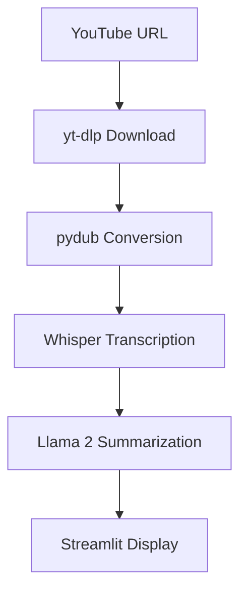

# YouTube Video Summarizer with Llama 2 & Whisper


## 📌 Table of Contents
- [Project Overview](#-project-overview)
- [Key Features](#-key-features)
- [Technology Stack](#-technology-stack)
- [Usage Instructions](#-usage-instructions)
- [Architecture](#-architecture)
- [Configuration](#-configuration)

## 🌟 Project Overview

An AI-powered pipeline that automatically:
1. Downloads YouTube videos
2. Extracts and converts audio to WAV format
3. Transcribes content using OpenAI's Whisper
4. Generates concise summaries using Meta's Llama 2 (7B 32k instruct model)

## 🚀 Key Features

| Feature | Implementation Details |
|---------|-----------------------|
| YouTube Processing | Uses `yt-dlp` for robust video downloads |
| Audio Conversion | Automatic WAV conversion via `pydub` |
| Transcription | Whisper large-v2 model for accurate STT |
| Summarization | Llama 2 7B with 32k context window |
| Web Interface | Streamlit with responsive layout |
| Error Handling | Comprehensive logging and user alerts |

## 🛠️ Technology Stack

### Core Components
- **Llama 2** (7B 32k instruct quantized GGUF)
- **Whisper** (OpenAI's speech-to-text)
- **Haystack** (v2.0 for pipeline orchestration)

### Supporting Libraries
```python
streamlit == 1.25.0
yt-dlp == 2023.7.6
llama-cpp-python == 0.2.6
pydub == 0.25.1
farm-haystack == 1.15.1
torch == 2.0.1
```
## 🖥️ Usage Instructions

## Commands to Setup Project on Local Machine

1. **Clone the repository:**
   ```bash
   git clone https://github.com/dyavadi8769/YouTube-Video-Summarizer-with-Llama-2-Whisper.git
   cd YouTube-Video-Summarizer-with-Llama-2-Whisper
2.  **Create a virtual environment and activate it:**
    ```bash
    conda create -p env python==3.9 -y
    conda activate env/ 
3.  **Install the Required Dependecies:**
    ```bash
    pip install -r requirements.txt
4. **Run the yt_summary.py :**
    ```bash
    streamlit run yt_summary.py
    ```

## 🏗️ Architecture



## ⚙️ Configuration

# Audio Settings
AUDIO_FORMAT = 'wav'        # Supported: wav, mp3, flac
BITRATE = '160kbps'         # Audio quality

# Model Parameters
MAX_TOKENS = 512            # Summary length
TEMPERATURE = 0.7           # 0-1 (higher = more creative)
GPU_ENABLED = False         # Set True for CUDA acceleration


# Author:

```bash
Author: Sai Kiran Reddy Dyavadi
Role  : Data Scientist
Email : dyavadi324@gmail.com
```


